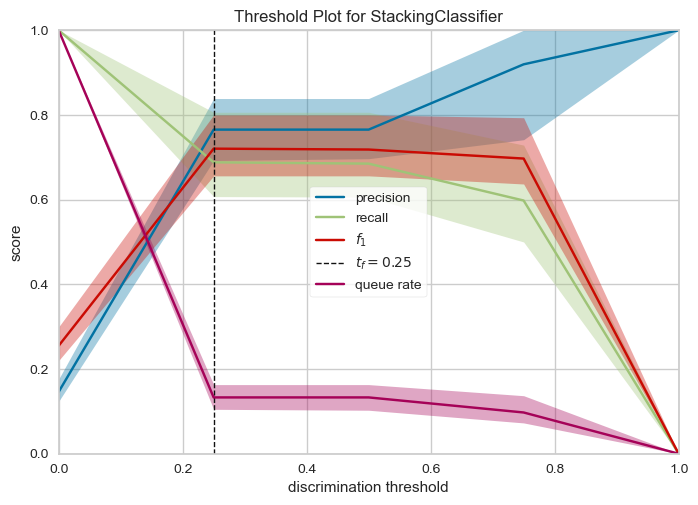

# Telecom Customer Churn Prediction

This project aims to predict customer churn in the telecom industry. 
The project uses a dataset containing customer information such as demographics, call history, service plans, and whether or not they churned.

## Project Plan

The project follows these steps:

1. **Problem Definition and Domain Exploration:** Understand the business context, define the churn problem, and assess the relevance of the data.

2. **Data Acquisition and Exploration:** Collect and understand the data, clean the data, and handle any data quality issues.

3. **Data Preparation:** Engineer new features, select the most relevant features, and perform exploratory data analysis.

4. **Preprocessing:** Encode categorical features, scale numerical features, and split the data into training and testing sets.

5. **Model Building and Training:** Select a suitable machine learning algorithm, train the model using the training data.

6. **Model Evaluation:** Evaluate the model's performance using various metrics, fine-tune the model's hyperparameters.

7. **Deployment and Monitoring:** Deploy the trained model, monitor its performance, and re-train or improve the model as needed.

## Libraries Used

The project uses several Python libraries:

- `numpy` and `pandas` for data manipulation
- `matplotlib` and `seaborn` for data visualization
- `sklearn` for machine learning tasks
- `mlxtend` for stacking multiple classifiers
- `xgboost` for the XGBoost classifier

## Models Used

The project explores several machine learning models:

- Logistic Regression
- Decision Tree Classifier
- Random Forest Classifier
- Gradient Boosting Classifier
- XGBoost Classifier
- Stacking Classifier (with Decision Tree, Random Forest, and Gradient Boosting as base learners, and Logistic Regression as a meta learner)

## Model Evaluation

The models are evaluated using several metrics:

- Accuracy
- Recall
- F1 score
- Precision
- ROC curve
- Confusion Matrix

## How to Run the Notebook

1. Install the necessary libraries. You can do this by running `pip install numpy pandas matplotlib seaborn sklearn mlxtend xgboost`.

2. Load the Jupyter notebook.

3. Run the cells in order from top to bottom.

Please note that you need to have the dataset in the same directory as the notebook for the data loading cell to work correctly. The dataset should be a CSV file named `../data/bigml.csv`.

## Results 

Approximately 14.5% of customers have churned, while 85.5% have not churned. 
This indicates that the dataset is imbalanced, with a higher proportion of non-churned customers compared to churned customers. 
We will need to consider this class imbalance when building and evaluating the churn prediction model.

We  observed a strong positive correlation between total day minutes and total day charge, as well as a positive correlation between total day minutes and total day calls. 
We  also observed a positive correlation between total night minutes and total night charge.
Understanding these correlations can help identify potential multi-collinearity between features and guide feature selection for building the churn prediction model.
Highly Correlated Features: Day/Eve/Night/International Minutes and Charges
We observe a high correlation (1) between:

Total day minutes & total day charge
Total eve minutes & total eve charge
Total night minutes & total night charge
Total intl minutes & total intl charge

he Logistic Regression model used in this context, with balanced class weights, has shown a good ability to predict customer churn. 
It has an accuracy of approximately 77%, and the ROC curve indicates a good balance between sensitivity and recall. 
The confusion matrix shows that the model has a higher number of false positives, indicating that it tends to predict churn where there isn't any. 
However, it's better to predict potential churn and take preventive measures than to miss out on customers who might churn.
The discrimination threshold plot can be used to adjust the threshold for predicting churn to balance precision and recall as per business requirements.

## Conclusion 
**Decision:**
- The ensemble stacking model outperforms the individual models, demonstrating the highest accuracy, recall, precision, and F1 score on both test and training data.
- The stacking model is recommended for its improved overall performance in predicting the target variable.

Stacking ROC Curve 

